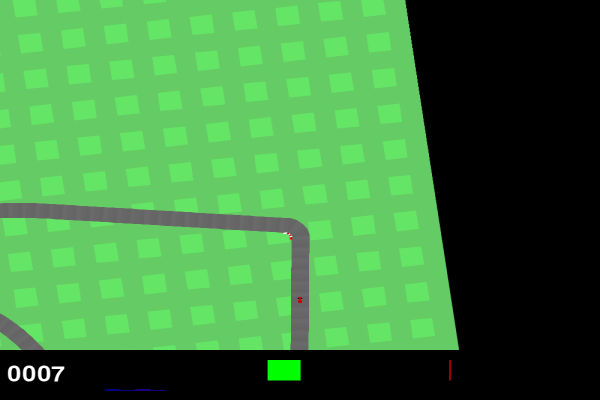
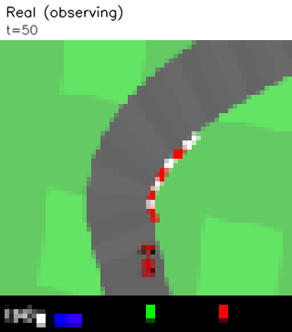
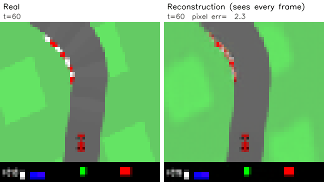
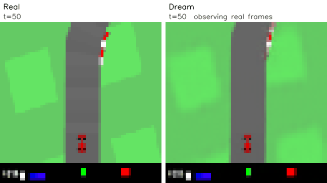

# Dreamer for CarRacing-v3

PyTorch로 구현한 모델 기반 강화학습(Dreamer) 에이전트
카메라 화면만 보고 환경의 동작 방식을 학습한 **World Model** 안에서 주행을 "상상"하며 정책을 학습하고, Gymnasium `CarRacing-v3`에서 **새 트랙 20개 평균 903점**(해결 기준 900점)을 달성

| 실제 주행 결과 | 상상 속 주행 (화면 없이 World Model 안에서 Actor가 운전) |
|:---:|:---:|
|  |  |

## Architecture

```
64x64 화면 → CNN Encoder → RSSM (결정적 h: GRU 512 + 확률적 z: 64×32 categorical)
                                │
                                ├─ Decoder / Reward / Continue 예측
                                │
                                └─ 상상 주행 (관측 없이 15 step) → Actor · Critic 학습
```

**World Model**
- **CNN Encoder / Decoder**: 64x64 관측을 1024차원 임베딩으로 압축하고, 잠재 상태에서 다시 이미지를 복원
- **RSSM**: GRU 기반 결정적 상태(h)와 이산 확률 상태(z, Straight-Through 샘플링)를 결합해 다음 상태를 예측. 관측이 있으면 posterior, 없으면 prior로 미래를 상상
- **Reward / Continue head**: 각 상태에서 받을 보상과 에피소드 지속 여부를 예측
- 학습: 이미지 복원 + 보상·종료 예측 + KL balancing(0.8, free bits)

**Behavior (Actor-Critic)**
- 실제 데이터에서 얻은 상태를 출발점으로 World Model 안에서 15 step을 상상하고, λ-return(γ=0.99, λ=0.95)으로 학습
- **Actor**: 조향·가속·브레이크 3차원 연속 행동. tanh 평균 + std∈[0.1, 1] 정규분포를 [-1, 1]로 clip하며, **REINFORCE**(advantage = (λ-return − V) / 수익 범위)로 학습
- **Critic**: 상태 가치 예측, 느리게 따라가는 target critic으로 λ-return을 계산

## Results

| World Model 복원 (매 스텝 관측) | World Model 예측 (같은 행동, 15 step마다 관측) |
|:---:|:---:|
|  |  |

- **복원**: 평균 픽셀 오차 1.7/255로 연석·계기판까지 거의 그대로 복원
- **예측**: 관측 없이 5 step 후 오차 4.6 → 30 step 후 12.7. 화면 밖의 트랙 모양은 알 수 없어, 길게 상상할수록 실제와 다른 도로를 만들어냄
- **한계**: 급커브에서 과속해 잔디로 이탈했다가 복귀하는 경우가 있고, 상상 속 보상이 실제보다 높게 예측되는 경향이 있음
